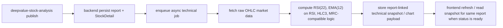

# DeepValue Lab Stock Detail Technical Entry Price Chart PRD

Date:
- 2026-03-25

Status:
- draft

## Summary

Add a price chart to the stock detail page's `Technical Entry Status` section so readers can visually inspect the technical setup that supports entry timing.

This feature is not a trading product and should not displace the valuation-first workflow. The chart is a confirmation layer that sits after thesis and valuation, not a substitute for them.

## Problem

The stock detail page already communicates valuation, thesis, and status clearly, but the technical entry section is still mostly textual.

That creates three gaps:
- readers cannot quickly see the actual price structure behind the technical judgment
- the technical section feels disconnected from the rest of the analysis
- the page cannot visually explain why an entry is favorable, neutral, or stretched

The product needs a chart that helps the reader answer:
- where is price relative to the current setup
- does the chart support the current technical entry status
- is the setup improving, weakening, or stretched

## Objective

Provide a stock detail price chart that:
- visually supports entry timing after valuation has already been established
- is subordinate to valuation sections and does not lead the page
- can later support RSI, EMA on RSI, and MRC-compatible stretch logic
- can move from mock data to real market data without changing the UI contract
- remains point-in-time and report-linked in v1 so the chart matches the published report snapshot

## Product Principles

- Technicals remain an execution layer after valuation, not the thesis.
- The chart must not be the first thing a reader sees on the page.
- The chart should feel like a research tool, not a broker widget.
- Real OHLC data will improve fidelity, but renderer quality and interaction grammar still matter.
- DailyDip is a visual reference, not a literal copy target.

## Target User Outcome

After landing on the stock detail page, a user should be able to:
- understand the current technical entry state at a glance
- see whether price action supports waiting, confirming, or acting
- visually connect the technical judgment to the valuation case above it

## UX Requirements

### Placement
- Place the chart inside the `Technical Entry Status` section.
- Keep it below valuation-related sections.
- Keep `Technical Entry Status` after `What The Current Price Implies` and before `Provisional Conclusion`.

### Layout
- Use a dark, compact trading-panel style.
- The chart should be the primary object in the section.
- Supporting text should be compact and secondary.
- Avoid a heavy report-card feel around the chart.

### Default View
- V1 should default to daily price data.
- Primary view should be `1Y`.
- Secondary quick ranges should be compact and limited to a small set, such as `1M`, `3M`, `6M`, `1Y`.

### Visual Behavior
- Use a price-first layout.
- Keep grid lines subtle.
- Keep annotations minimal.
- Use a right-side current price rail or equivalent visual anchor.
- If indicators are not rendered yet, do not pretend they are.

### Copy
- The chart should be labeled as technical context, not as proof of intrinsic value.
- Any status label should stay outside the plot area if it improves readability.

## Scope For V1

V1 should include:
- a price chart in the stock detail `Technical Entry Status` section
- daily OHLC-backed rendering
- a `1Y` primary view
- compact time range controls
- a compact technical summary below the chart
- a clear fallback when chart data is missing

V1 should be good enough to validate:
- layout
- hierarchy
- readability
- chart fidelity
- contract shape for future real data

## Explicit Non-Scope

V1 will not include:
- intraday trading view parity
- live streaming updates
- full crosshair or trading-terminal interaction complexity
- user-drawn studies
- chart comparison mode
- alerts UI
- exact TradingView Pine-script parity
- automatic thesis rewriting

## Data Requirements

### Required Price Data

The chart needs historical OHLC data:
- `open`
- `high`
- `low`
- `close`
- `volume` if available
- `adjusted` or `unadjusted` flag if available

### Required Indicator Data

The technical pipeline must support:
- `RSI` with length `22`
- `EMA` on RSI with length `12`
- `HLC3` for MRC-compatible logic
- MRC-compatible centerline and band values
- technical entry classification such as `favorable`, `neutral`, or `stretched`

### Calculation Rule

DeepValue should compute its own indicators for consistency.

Massive may expose built-in RSI and EMA endpoints, but DeepValue should still treat Massive as the raw market-data source, not the final source of truth for indicators.

Important constraint:
- the DeepValue spec uses `EMA on RSI`, not `EMA on price`
- `HLC3` can be derived from OHLC data
- MRC-compatible logic should be computed in DeepValue's own pipeline to preserve interpretation consistency

Report technical prose and stored technical snapshots are separate concerns:
- report prose captures analysis-time judgment and remains part of the research archive
- technical snapshots capture the point-in-time computed market state for that published report
- the frontend should read the stored snapshot for the same report, not recompute or reinterpret report prose

Source-of-truth precedence:
- report technical prose is the audit-trail narrative for the published report
- the report-linked technical snapshot is the chart and rendering truth for that same report
- provider data remains raw input only
- if prose wording and snapshot state differ, the UI should render both without rewriting either: prose stays in the report section, snapshot drives the chart section

## Proposed Payload Shape

The frontend should consume a structured chart payload instead of raw vendor responses.

```ts
type TechnicalChartRange = '1M' | '3M' | '6M' | '1Y'

type TechnicalPricePoint = {
  date: string
  open: number
  high: number
  low: number
  close: number
  volume?: number
}

type TechnicalIndicatorSnapshot = {
  rsi: {
    length: 22
    value: number
    emaLength: 12
    emaValue: number
    state: 'bullish' | 'neutral' | 'weak'
  }
  mrc: {
    input: 'hlc3'
    centerline: number
    innerBand: number
    outerBand: number
    zone: 'lower' | 'center' | 'upper' | 'stretched'
  }
}

type TechnicalPriceChartPayload = {
  source: 'massive' | 'mock'
  reportId: string
  primaryRange: TechnicalChartRange
  updatedAtMs: number
  seriesByRange: Record<TechnicalChartRange, TechnicalPricePoint[]>
  indicators: TechnicalIndicatorSnapshot
  technicalEntryStatus: 'favorable' | 'neutral' | 'stretched'
}

type TechnicalSnapshotState = 'pending' | 'ready' | 'failed'
```

Notes:
- The exact field names can change, but the data split should remain the same.
- The frontend should not need to recompute the chart from raw vendor JSON.
- The chart payload should live in a separate technical snapshot record that is keyed by `reportId`.
- The report publish path should remain synchronous; technical snapshot generation should be asynchronous and report-linked.

## Read Contract

- `GET /v1/stocks/{ticker}` remains the primary detail contract for report-backed `StockDetail` data.
- `GET /v1/stocks/{ticker}/reports` remains report metadata only.
- `GET /v1/stocks/{ticker}/reports/{reportId}/technical-snapshot` returns the report-linked technical snapshot for that specific report.
- The frontend renders the report detail and technical snapshot together by matching `reportId`.
- If the snapshot is `pending`, the UI shows a loading or drawing state.
- If the snapshot is `ready`, the UI renders the chart and indicator state.
- If the snapshot is `failed`, the UI shows a failed-to-draw state and leaves the report prose visible.

Snapshot state expectations:
- `pending`: job accepted, chart not ready yet
- `ready`: chart and indicators are available
- `failed`: job exhausted its allowed retries or could not complete deterministically

Retry expectation:
- backend should retry transient technical job failures a small number of times before marking the snapshot `failed`
- retry policy details belong to implementation, but the product contract must preserve the `pending -> ready/failed` progression and allow a later requeue if the report is republished or manually retried

## Architecture Direction

### Recommended Provider Strategy

Use [Massive](https://massive.com/) as the raw historical market-data source.

Why:
- it provides standard OHLCV aggregates
- it supports historical data at a practical cost
- it is sufficient to drive chart fidelity and indicator calculation

What it should not be:
- the final truth source for DeepValue indicators

### Recommended Calculation Strategy

Pipeline order:
1. `deepvalue-stock-analysis` publishes report + `StockDetail` JSON synchronously
2. backend persists the report snapshot immediately
3. backend enqueues an async technical job
4. job fetches historical OHLC data from Massive
5. normalize and cache the series
6. compute RSI in DeepValue
7. compute EMA on RSI in DeepValue
8. compute HLC3 and MRC-compatible channel in DeepValue
9. store the technical snapshot / chart payload in persistent storage keyed by the report
10. frontend refreshes and reads the report-linked snapshot when state is `ready`



### Frontend Reality

The repo is still frontend-first for this feature, so the current implementation can keep using mock chart data for UI iteration.

But the target production contract should already assume:
- report publish and technical snapshot generation are separate steps
- chart payload is stored independently from the report prose, but linked to the same reportId
- frontend reads a structured snapshot for the same published report
- the UI does not own indicator math for live data

## Prototype vs Production

### Prototype

Prototype goals:
- validate the chart shell
- validate chart-to-text hierarchy
- validate readability against DailyDip-like references
- validate that the section does not overpower valuation content

Prototype can use:
- mock series
- deterministic generated data
- frontend-only rendering

### Production

Production goals:
- use real OHLC data
- compute indicators in the DeepValue pipeline
- publish the report first, then generate and store the technical snapshot asynchronously
- keep the technical snapshot report-linked so the chart matches the published report context
- keep frontend logic focused on rendering only

## Acceptance Criteria

The feature is complete when:
- the stock detail page shows a chart in `Technical Entry Status`
- the chart is visually subordinate to valuation sections
- the chart renders a daily price view by default
- the chart supports a `1Y` primary view
- the page still reads clearly without chart data
- the technical summary remains readable without repeating the full valuation narrative
- the chart can be driven by a structured payload, not only by mock data
- RSI, EMA on RSI, and MRC-compatible logic are represented in the data model

## Rollout Plan

### Phase 1
- finalize chart layout and section hierarchy
- keep mock data acceptable for UI validation

### Phase 2
- add the published report contract plus report-linked technical snapshot contract
- wire real OHLC data ingestion
- compute RSI, EMA on RSI, HLC3, and MRC-compatible values in the pipeline

### Phase 3
- replace mock series with real published series
- validate the chart against the same report context that generated it
- verify that chart state and technical status stay aligned for that report
- defer any continuously refreshed monitoring system to a later, separate feature

## Task Breakdown

### Product / UX
- confirm v1 chart placement and default timeframe
- confirm how much technical text remains below the chart
- confirm whether the chart should show any indicator overlays in v1

### Frontend
- keep the chart component isolated
- ensure the detail page can render with or without chart payloads
- keep the chart visually aligned with the current dark editorial direction

### Data Pipeline
- ingest historical OHLC from Massive
- compute indicator values in DeepValue
- persist the technical snapshot separately after publish

### Backend / Contract
- add the technical snapshot contract alongside the published stock detail shape
- keep the report read path simple and deterministic
- keep the technical snapshot read path separate, deterministic, and keyed by reportId
- preserve locale behavior for any technical commentary that may accompany the chart

## Engineering Execution Checklist

### Execution Order

1. Lock product and UX contract
2. Clean up the current frontend prototype
3. Define provider and data ingestion path
4. Implement indicator calculation pipeline
5. Publish and read the structured chart payload
6. Validate rendering and data consistency
7. Roll out behind a controlled surface

Dependencies:
- frontend cleanup should not assume real market data
- provider integration should not land before the payload shape is agreed
- indicator calculation should be validated before publish/read contract is finalized
- rollout should wait until QA and data parity checks pass

### 1. Product / UX Contract

- [x] Confirm the technical chart remains subordinate to valuation and thesis sections.
- [x] Confirm the v1 placement stays inside `Technical Entry Status`.
- [x] Confirm the v1 default view is daily and primary range is `1Y`.
- [x] Confirm the v1 control set is limited to compact time ranges only.
- [x] Confirm the chart keeps a summary rail below the plot and no status chip inside the chart.
- [x] Confirm the non-scope list for v1: no intraday streaming, no alerts UI, no compare mode, no user-drawn studies.
- [x] Freeze the chart copy labels that will appear in EN and zh-TW.

Resolved in:
- `docs/product/deepvalue-lab-stock-detail-technical-entry-chart-ux-contract.md`

Definition of done:
- product and UX decisions are stable enough that engineering can build without reopening scope.

### 2. Frontend Prototype Cleanup

- [x] Keep the stock detail page rendering correctly when chart data is missing.
- [x] Remove any remaining chart-local status label that competes with the plot.
- [x] Keep the technical summary rail compact and readable beneath the chart.
- [ ] Ensure the chart shell still reads as a trading-style panel on desktop and mobile.
- [ ] Verify the chart does not dominate the page above valuation sections.
- [x] Keep mock chart data isolated from live read-path logic.
- [x] Confirm the technical signals presentation stays secondary to the chart.

Definition of done:
- the current UI prototype is visually aligned with the target direction and no longer leaks mock assumptions into the live data path.

### 3. Provider / Ingestion Path

- [ ] Select the raw market-data source for v1 and document the choice in the implementation notes.
- [ ] Confirm the raw provider delivers historical OHLC data for the intended time range.
- [ ] Confirm the provider supports adjusted or unadjusted bars as needed.
- [ ] Confirm the provider plan chosen for v1 satisfies the expected request rate and historical depth.
- [ ] Define the fetch cadence for chart data refresh.
- [ ] Define cache behavior for repeated views of the same ticker and range.
- [ ] Define the fallback behavior when provider data is stale or unavailable.

Definition of done:
- engineering has a documented path from provider to normalized historical bars with clear cache and fallback rules.

### 4. Indicator Calculation Pipeline

- [ ] Implement RSI with length `22`.
- [ ] Implement EMA on RSI with length `12`.
- [ ] Implement HLC3 from OHLC data.
- [ ] Implement the MRC-compatible centerline and band calculation using the approved approximation.
- [ ] Confirm the indicator pipeline computes on the same historical series used by the chart.
- [ ] Confirm rounding and formatting rules for indicator values.
- [ ] Confirm indicator output includes a readable zone/status classification for the technical section.
- [ ] Confirm the indicator pipeline does not rely on the frontend to recompute live data.

Definition of done:
- a single backend or pipeline step can produce the chart indicators deterministically from the historical bars.

### 5. Publish / Read Contract

- [ ] Define the structured payload shape for the stored technical snapshot and chart series.
- [ ] Key the technical snapshot by `reportId` so each published report has its own chart payload.
- [ ] Keep the published stock detail contract separate from the technical snapshot contract.
- [ ] Confirm the frontend can render from the stored snapshot without vendor-specific parsing.
- [ ] Preserve backward compatibility for stock detail payloads that do not yet include chart data.
- [ ] Confirm locale behavior for the chart section does not require separate data semantics.
- [ ] Confirm the read path treats report prose and technical snapshot data as separate sources.
- [ ] Confirm the read path always prefers the technical snapshot linked to the same report when rendering the chart.
- [ ] Define the `pending -> ready -> failed` snapshot lifecycle and the FE state for each status.
- [ ] Define the separate snapshot endpoint shape keyed by `ticker + reportId`.

Definition of done:
- the frontend can consume a stored technical snapshot as a stable contract while report prose remains unchanged and report-linked.

### 6. QA / Validation

- [ ] Validate the chart on at least one stock with a stable live detail payload.
- [ ] Validate the chart on at least one stock using only mock data fallback.
- [ ] Validate EN and zh-TW rendering.
- [ ] Validate desktop and mobile layouts.
- [ ] Validate that the chart still renders when indicator data is absent but price data exists.
- [ ] Validate that valuation sections remain above the chart in reading order.
- [ ] Validate the chart against the DailyDip visual reference for overall panel feel.
- [ ] Run lint and build after each material UI or data contract change.

Definition of done:
- the feature passes layout, data fallback, and contract checks without regressions in the stock detail page.

### 7. Rollout

- [ ] Land the chart behind the current mock data path first if needed.
- [ ] Switch the chart to a stored technical snapshot only after the publish/read contract is available.
- [ ] Keep indicator overlays disabled until the indicator pipeline is validated.
- [ ] Enable production chart rendering only after one full end-to-end ticker pass has been verified.
- [ ] Keep continuous daily monitoring as a separate later system, not part of the v1 report-linked chart path.
- [ ] Document the rollback path if provider data or indicator output is inconsistent.
- [ ] Add a follow-up task for RSI/MRC overlay parity if the first release ships with price-only rendering.

Definition of done:
- the feature can be released incrementally with a clear rollback path and no hidden dependency on unfinished indicator work or later monitoring refreshes.

## Open Questions

- Do we want the chart to be source-driven by Massive only, or support multiple providers behind the same contract?
- What exact adjusted vs unadjusted basis should v1 use for indicator parity sign-off?
- What lookback and warm-up requirements should be enforced before a snapshot can be marked `ready`?

## Risks

- Real market data will improve the chart, but not automatically make it feel like DailyDip.
- Indicator mismatch risk exists if DeepValue and the provider compute different formulas.
- If chart controls become too dense, the section will compete with valuation instead of supporting it.
- If the chart is too small, the technical section will feel decorative rather than useful.
- If the data contract is not published and versioned, the frontend may keep drifting from the production truth source.

## Recommendation

Ship the chart in two steps:
- first, finalize the UI and hierarchy with mock data
- then, switch the chart to a published OHLC + indicator snapshot generated from Massive-backed data

That keeps the product moving without locking the frontend to a vendor-specific representation.
